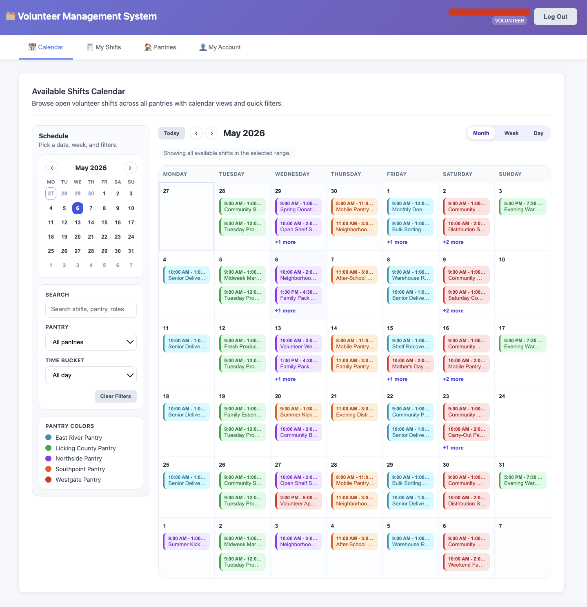
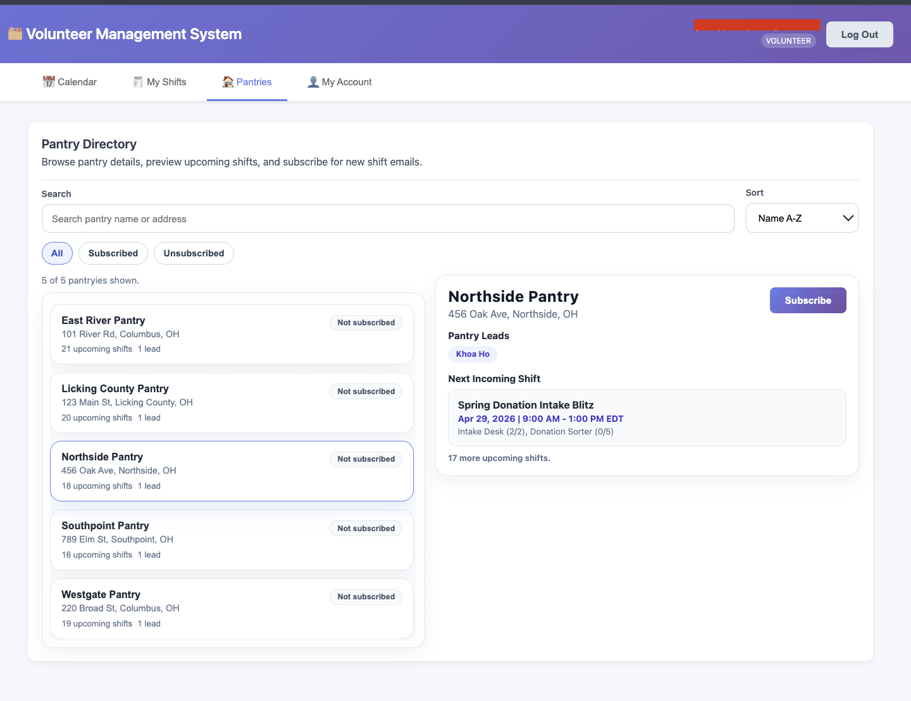
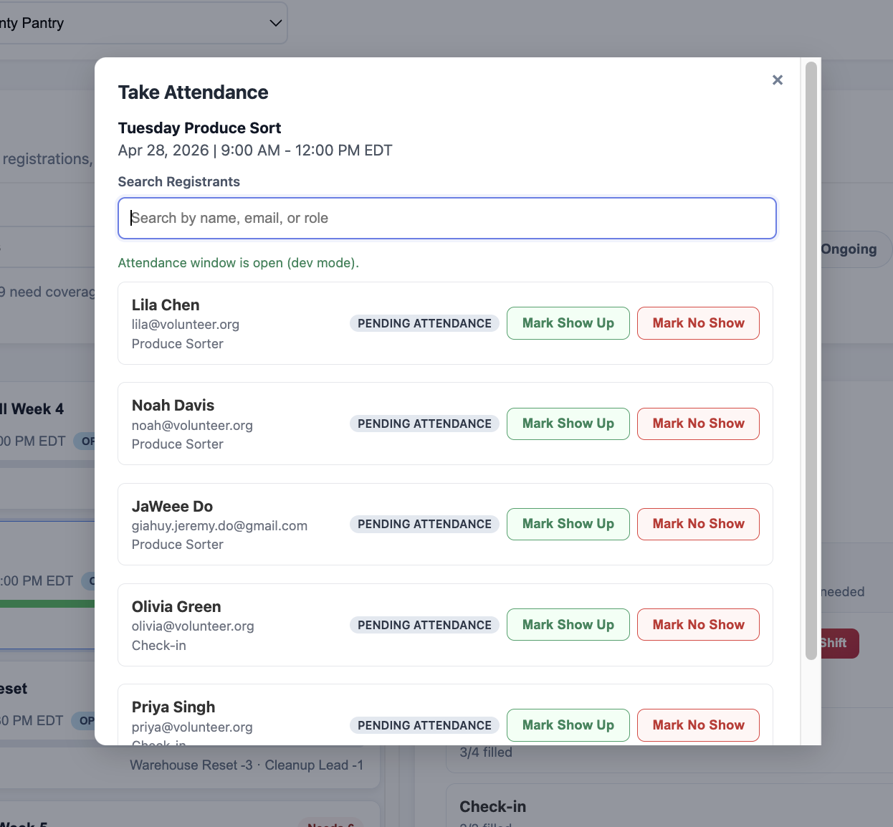
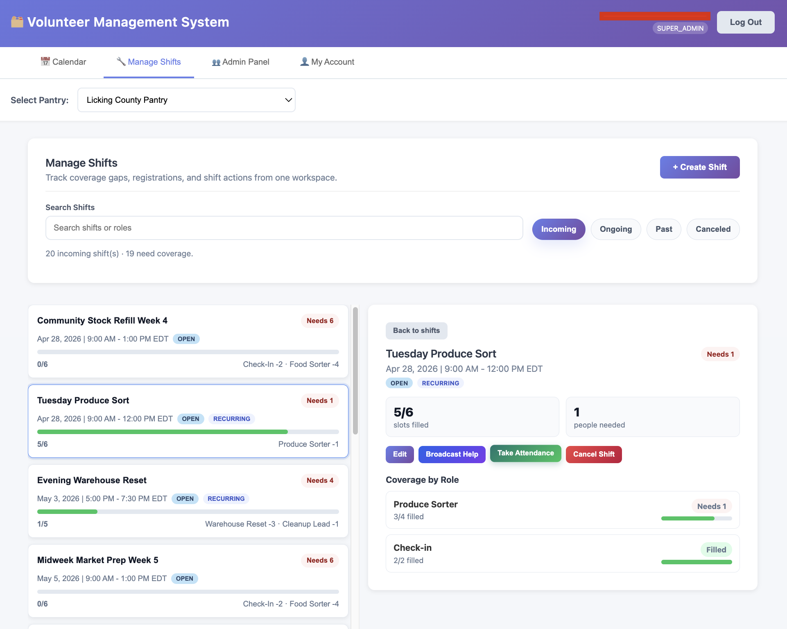

# Volunteer Management System

A volunteer scheduling and coordination app for food pantries.

The goal of this project is to make shift planning easier for pantry teams, reduce missed coverage, and give volunteers a simple way to find, track, and manage opportunities. It also serves as a practical full-stack project that shows how a real scheduling workflow can connect people, roles, and notifications in one place.

The deployed site serves a public homepage and privacy policy for Google OAuth verification, while the authenticated app dashboard is available at `/dashboard`.

## Why This Exists

Food pantry scheduling often breaks down because the work spans too many manual steps: finding volunteers, filling open roles, following up on changes, and keeping everyone informed. This app is built to reduce that friction.

This app addresses the common pain points of pantry scheduling such as: Missed communication, last-minute cancellations, and lack of visibility into who is signed up for what. By centralizing shift management, automating reminders, and making it easy for volunteers to sign up and confirm their attendance, the app helps pantry teams keep their schedules full and their volunteers engaged.

This app also prevents understaffing by giving pantry leads a clear view of their volunteer roster, sending timely reminders to volunteers, and providing an on-call list for backup coverage when shifts are at risk. The goal is to make it easier for pantry teams to keep their shelves stocked and their communities supported.

The app also helps prevent volunteer overbooking by displaying real-time shift capacity, sending reconfirmation emails when shift updates require volunteers to confirm their attendance again, and setting cooldown reservation windows to prevent bots or overly eager volunteers from signing up for all available shifts within a short period.

It helps pantry teams:

- organize shifts in one place
- keep lead and admin workflows simple
- notify volunteers when coverage changes
- give volunteers a clear view of where they are needed
- keep the experience friendly for day-to-day use on both desktop and mobile

## Preview

## Documentation

This README intentionally stays high level. For the full details, see the docs folder:

- [Setup Guide](docs/SETUP.md) - local setup, environment configuration, and startup instructions
- [Application Flow](docs/APPLICATION_FLOW.md) - how the app works end to end
- [Data Model](docs/data_model.md) - database schema, relationships, and runtime data flow
- [Knowledge Transfer](docs/knowledge_transfer.md) - system design, architecture notes, and future direction
- [Deployment Guide](docs/DEPLOY_DIGITALOCEAN.md) - production deployment on DigitalOcean
- [Deployment FAQ](docs/DEPLOYMENT_FAQ.md) - common deployment issues and fixes
- [MVP Features](docs/MVP_FEATURES.md) - product scope and feature priorities

## Getting Started

If you want to run the app locally, start with [docs/SETUP.md](docs/SETUP.md).

## Project Direction

For design notes, future improvements, and system direction, see [docs/knowledge_transfer.md](docs/knowledge_transfer.md).

## Contributors

| Name         | Email                 |
| :----------- | :-------------------- |
| Jaweee Do    | do_g1@denison.edu     |
| Dong Tran    | tran_d2@denison.edu   |
| Jenny Nguyen | nguyen_j6@denison.edu |
| Khoa Ho      | ho_d1@denison.edu     |
| Hoang Ngo    | ngo_h2@denison.edu    |
