# System-Level Documentation

This document describes the Volunteer Management System at the system level. It explains the application boundaries, runtime lifecycle, backend and frontend architecture, storage model, authentication model, integrations, operational configuration, and important business workflows.

## 1. System Purpose

The Volunteer Management System coordinates pantry volunteer scheduling. It gives volunteers a way to discover shifts, sign up, manage commitments, reconfirm after schedule changes, and optionally sync confirmed shifts to Google Calendar. It gives pantry leads and administrators tools to create shifts, manage coverage, assign pantry leads, send help broadcasts, mark attendance, and keep volunteers informed through email notifications.

The application serves both public and authenticated surfaces:

- Public homepage, terms, and privacy pages for product discovery and Google OAuth verification.
- Public pantry and shift endpoints for read-only pantry schedule visibility.
- Authenticated dashboard at `/dashboard` for all role-specific workflows.
- JSON API under `/api/*` for frontend operations.

## 2. High-Level Architecture

The project is a monolithic Flask application with a browser-rendered frontend and a swappable persistence layer.

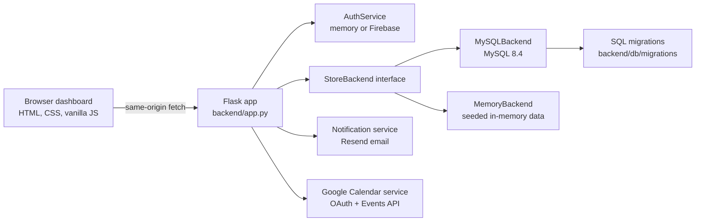

Primary architectural characteristics:

- `backend/app.py` is the HTTP boundary and orchestration layer.
- `backend/backends/base.py` defines the storage contract used by the Flask app.
- `backend/backends/mysql_backend.py` is the production persistence implementation.
- `backend/backends/memory_backend.py` is the lightweight development and test implementation.
- `backend/auth/base.py` defines the authentication contract.
- `backend/auth/memory_auth_service.py` supports local sample-account login.
- `backend/auth/firebase_auth_service.py` supports Firebase Google authentication.
- `frontend/templates/dashboard.html` serves the authenticated app shell.
- `frontend/static/js/*.js` implements the single-page dashboard behavior with vanilla JavaScript.

## 3. Repository Map

```text
volunteer_managing/
+-- backend/
|   +-- app.py                         # Flask app, route handlers, business orchestration
|   +-- auth/                          # Auth service interface and implementations
|   +-- backends/                      # StoreBackend interface plus MySQL and memory stores
|   +-- db/                            # MySQL pool, schema initialization, seed loader
|   +-- notifications/                 # Resend email notification helpers
|   +-- google_calendar.py             # Google OAuth and Calendar Events API helpers
|   +-- data/                          # Seed data for MySQL and memory modes
+-- frontend/
|   +-- templates/                     # Public pages and dashboard shell
|   +-- static/
|       +-- css/                       # Public and dashboard styles
|       +-- js/                        # Browser-side API wrappers and dashboard modules
+-- tests/                             # Unit, route, component, backend, integration-style tests
+-- docs/                              # Project documentation
+-- docker-compose.yml                 # Local MySQL service
+-- docker-compose.test.yml            # Component-test database setup
+-- requirements.txt                   # Root Python requirements
+-- backend/requirements.txt           # Backend runtime requirements
```

## 4. Runtime Startup Lifecycle

At process startup, `backend/app.py` configures the Flask app and initializes global service singletons.

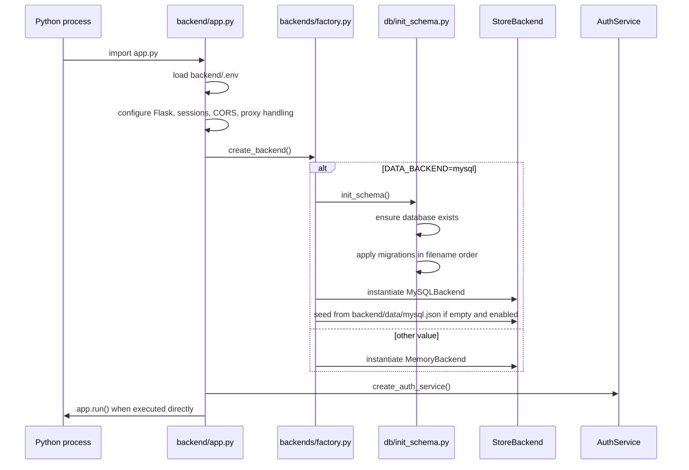

Important startup behavior:

- Environment variables are loaded from `backend/.env`.
- Production requires `FLASK_SECRET_KEY`; development falls back to a local secret.
- `TRUST_REVERSE_PROXY` enables `ProxyFix` for deployments behind a reverse proxy.
- CORS is restricted by `CORS_ALLOWED_ORIGINS` when configured. In non-production, permissive CORS is enabled for development.
- The selected storage backend is created once and used as a module-level singleton.
- The selected auth service is created once and used as a module-level singleton.

## 5. Request Lifecycle

Every request passes through `set_current_user()` in `backend/app.py`.

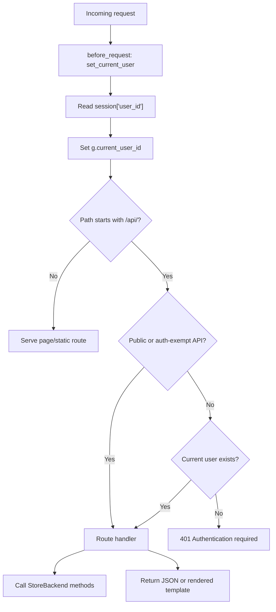

Auth-exempt API paths include auth configuration, login, signup, logout, `/api/me`, and public API routes. Most other API routes require a session-backed user.

The frontend sends browser timezone information through the `X-Client-Timezone` header from `frontend/static/js/api-helpers.js`. `current_user()` can persist that timezone to the user record through `sync_user_timezone_from_request()`.

## 6. Role and Permission Model

The system uses role rows in `roles` and user-role links in `user_roles`.

Supported role names in current application logic:

- `VOLUNTEER`
- `PANTRY_LEAD`
- `ADMIN`
- `SUPER_ADMIN`

Permission rules:

- Volunteers can browse available pantry shifts, subscribe to pantry notifications, sign up for roles, cancel their own signups, reconfirm after changes, and manage their own profile.
- Pantry leads can manage shifts only for pantries where they are assigned as a lead.
- Admin-capable users are users with `ADMIN` or `SUPER_ADMIN`. They can manage pantries, users, pantry leads, and shifts across pantries.
- The protected seeded super admin account uses `user_id = 1` and cannot have its roles edited or delete itself through the application.
- The runtime admin-management flow permits only one editable role per normal user.
- `SUPER_ADMIN` cannot be assigned through the role-management endpoint.

Key permission helpers live in `backend/app.py`:

- `user_has_role()`
- `is_super_admin()`
- `is_admin_capable()`
- `user_can_manage_pantry()`
- `ensure_shift_manager_permission()`
- `volunteer_user_required()`

## 7. Authentication Architecture

Authentication is abstracted behind `AuthService`.

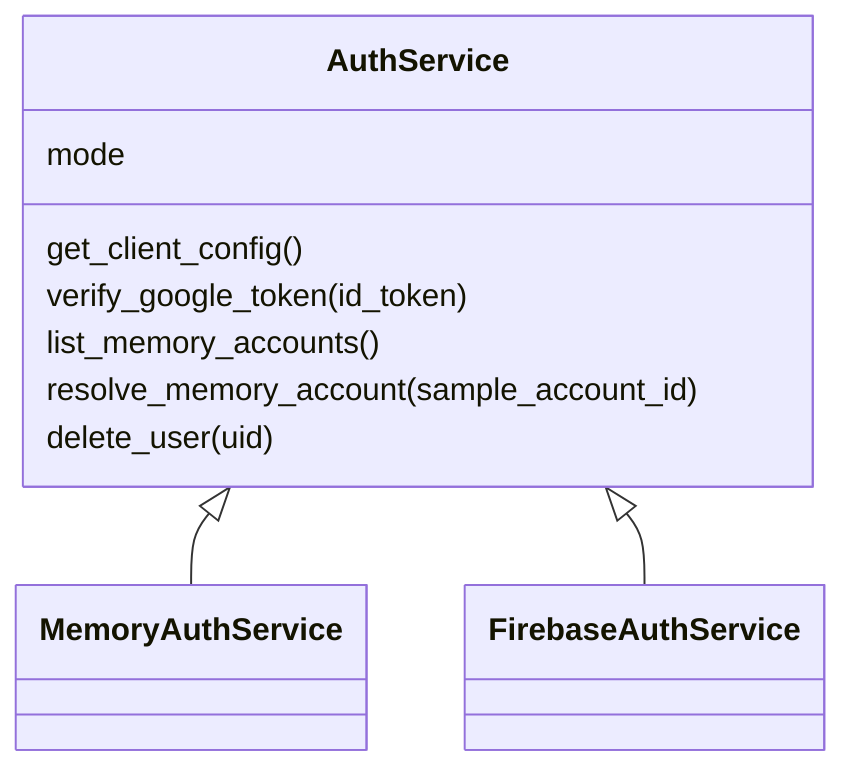

### Memory Auth Mode

`AUTH_PROVIDER=memory` is used for local development and tests.

Behavior:

- `/api/auth/config` returns a list of sample accounts.
- `/api/auth/login/memory` maps the selected sample account email to an existing local user.
- Google login and signup are disabled.
- External identity deletion is a no-op.

### Firebase Auth Mode

`AUTH_PROVIDER=firebase` is used for Google sign-in backed by Firebase Admin verification.

Behavior:

- `/api/auth/config` returns Firebase browser configuration.
- The browser uses the Firebase JavaScript SDK and Google popup sign-in.
- The frontend sends a Firebase ID token to `/api/auth/login/google` or `/api/auth/signup/google`.
- The backend verifies the token with Firebase Admin.
- Verified Google identities are linked to local users by `auth_uid`.
- New Google signups create local users with the `VOLUNTEER` role.
- Account deletion removes the Firebase user first, then removes the local user row.

Firebase configuration is required at startup in Firebase mode:

- `FIREBASE_API_KEY`
- `FIREBASE_AUTH_DOMAIN`
- `FIREBASE_PROJECT_ID`
- `FIREBASE_APP_ID`
- `FIREBASE_ADMIN_CREDENTIALS`

`FIREBASE_ADMIN_CREDENTIALS` can be either inline JSON or a readable file path.

## 8. Data Storage Architecture

The storage layer is accessed only through `StoreBackend`. This keeps route logic independent of MySQL-specific details and makes the memory backend viable for fast tests.

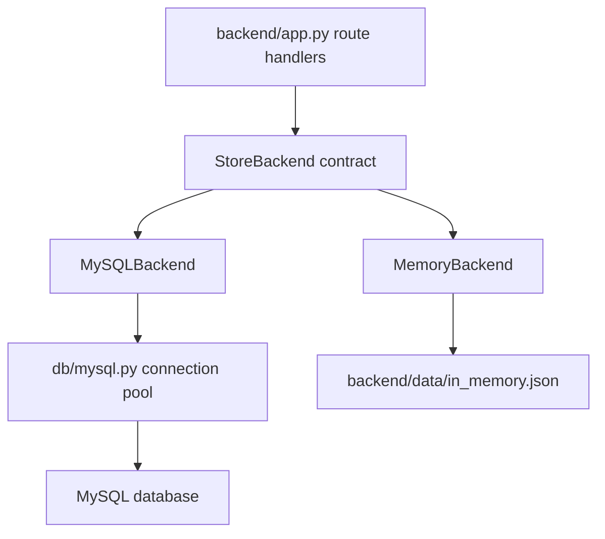

`DATA_BACKEND=mysql` selects MySQL. Any other value falls back to memory mode.

MySQL startup behavior:

- `backend/db/init_schema.py` creates the database if needed.
- Migrations in `backend/db/migrations/` are applied in filename order.
- Schema files use `CREATE TABLE IF NOT EXISTS`, so startup is idempotent for the baseline schema.
- If `SEED_MYSQL_FROM_JSON_ON_EMPTY=true` and the database has no runtime data, `backend/db/seed.py` loads `backend/data/mysql.json`.

MySQL connection behavior:

- `backend/db/mysql.py` creates a singleton `MySQLConnectionPool`.
- Pool size defaults to `MYSQL_POOL_SIZE=5`.
- Connections are borrowed through `get_connection()` and returned by closing the pooled connection.
- Autocommit is disabled; write operations commit explicitly.

## 9. Database Model

Core tables from `001_initial.sql`:

- `roles`: system role definitions.
- `users`: user profile, identity-link, timezone, and attendance score.
- `user_roles`: many-to-many user role assignments.
- `pantries`: pantry locations.
- `pantry_leads`: assigned pantry lead users.
- `pantry_subscriptions`: volunteer subscriptions to pantry updates.
- `shift_series`: recurring shift metadata.
- `shifts`: concrete shift occurrences.
- `shift_roles`: role slots within a shift.
- `shift_signups`: user signups for shift roles.
- `help_broadcasts`: per-sender broadcast history and cooldown support.

Google Calendar tables from `002_google_calendar_sync.sql`:

- `google_calendar_connections`: one OAuth connection per user.
- `google_calendar_event_links`: mapping from local signup to Google Calendar event.

Relationship summary:

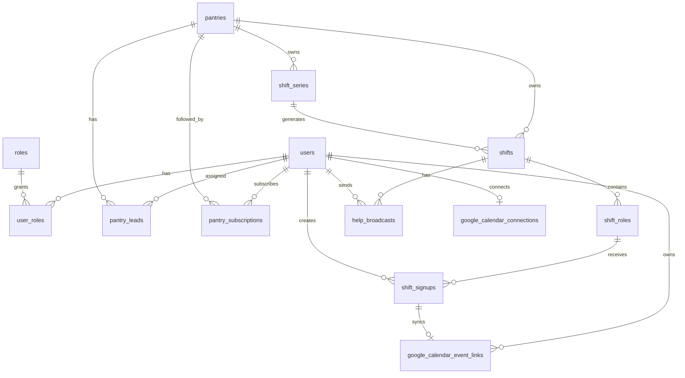

Important constraints:

- `users.email` is unique.
- `users.auth_uid` is unique when present.
- `user_roles`, `pantry_leads`, and `pantry_subscriptions` use composite primary keys.
- `shift_signups` prevents duplicate signup to the same role with `(shift_role_id, user_id)`.
- `shift_signups.reservation_expires_at` supports reconfirmation reservation windows.
- `shifts.shift_series_id` is nullable so one-off shifts and recurring occurrences share the same table.
- `shifts.created_by` and `shift_series.created_by` use `ON DELETE SET NULL`.
- Dependent join and child records cascade when users, pantries, shifts, or signups are deleted.

## 10. Main Domain Workflows

### 10.1 User Login and App Boot

```mermaid
sequenceDiagram
    participant Browser
    participant API as Flask API
    participant Auth as AuthService
    participant Store as StoreBackend

    Browser->>API: GET /api/auth/config
    API->>Auth: get_client_config()
    API-->>Browser: provider config
    Browser->>API: GET /api/me
    alt existing session
        API->>Store: get_user_by_id()
        API-->>Browser: current user + roles
        Browser->>Browser: initialize dashboard UI
    else no session
        API-->>Browser: 401
        Browser->>Browser: show auth shell
    end
```

The dashboard boot path is implemented in `frontend/static/js/auth.js` and `frontend/static/js/dashboard.js`.

### 10.2 Volunteer Signup

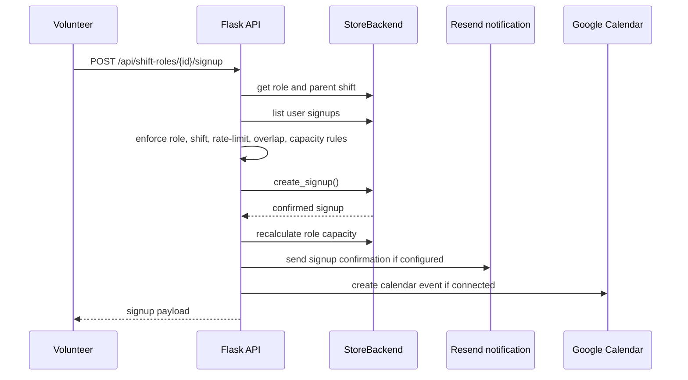

Signup business rules:

- Only `VOLUNTEER` users can sign themselves up.
- Cancelled shifts and cancelled shift roles cannot receive signups.
- Ended shifts cannot receive signups.
- A user cannot register for overlapping active shifts.
- A user can sign up for at most `MAX_SIGNUPS_PER_24_HOURS` shifts in a rolling 24-hour window.
- MySQL signup creation uses row locks and transactional capacity checks to avoid overbooking.

### 10.3 Shift Creation

Pantry leads and admin-capable users can create shifts.

One-off creation:

- Request goes to `/api/pantries/{pantry_id}/shifts/full-create`.
- The API validates the shift time window and submitted roles.
- `create_shift_with_roles()` creates the shift and role rows.
- Pantry subscribers receive a new-shift email if Resend is configured.

Recurring creation:

- The same endpoint accepts a `recurrence` payload.
- `normalize_recurrence_payload()` validates recurrence input.
- `generate_weekly_occurrences()` creates concrete occurrence windows.
- `shift_series` stores recurrence metadata.
- Each occurrence is a normal row in `shifts` linked by `shift_series_id`.
- Subscriber email sends a series summary with preview occurrences.

Recurring limits:

- Current recurrence frequency is weekly.
- End modes are finite: count-based or until-date based.
- Maximum generated occurrences are capped by `MAX_RECURRING_OCCURRENCES`.

### 10.4 Shift Updates and Reconfirmation

When a shift or shift role changes, existing signups may need reconfirmation.

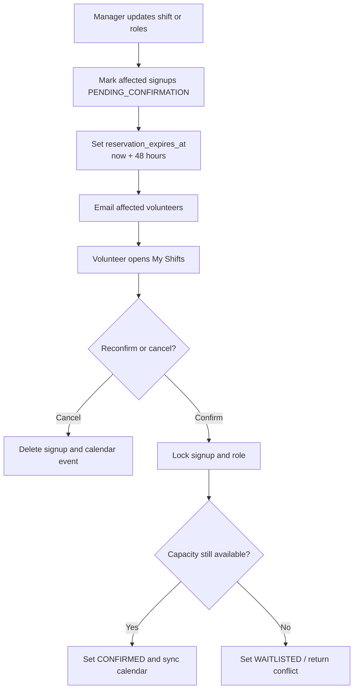

Important states:

- `CONFIRMED`: active signup.
- `PENDING_CONFIRMATION`: reserved slot that must be reconfirmed.
- `WAITLISTED`: reconfirmation could not reclaim capacity.
- `CANCELLED`: cancelled signup state where applicable.
- `SHOW_UP` and `NO_SHOW`: attendance outcomes that still count as lead-visible active records.

Pending confirmation behavior:

- Shift edits mark affected signups pending.
- Pending signups reserve capacity for 48 hours.
- If a shift starts before reconfirmation, pending signups can expire.
- Reconfirmation is first-come-first-serve if capacity was reduced.

### 10.5 Cancelling Shifts

Managers can cancel a single shift or future occurrences in a recurring series.

Endpoints:

- `DELETE /api/shifts/{shift_id}` cancels a single shift.
- `POST /api/shifts/{shift_id}/cancel` accepts `apply_scope=single` or `future`.

Behavior:

- Ended shifts are locked by the past-shift guard.
- Cancelled shifts trigger affected-signup collection.
- Volunteers are notified through cancellation emails when configured.
- Linked Google Calendar events are updated or removed based on signup state.

### 10.6 Attendance

Pantry leads and admin-capable users can mark attendance after the attendance window opens.

Endpoint:

- `PATCH /api/signups/{signup_id}/attendance`

Valid attendance statuses:

- `SHOW_UP`
- `NO_SHOW`

Attendance affects `users.attendance_score`. The frontend displays this as a credibility or reliability signal in the account and admin views.

### 10.7 Help Broadcasts

Help broadcasts let managers contact selected volunteers when a shift needs coverage.

Workflow:

- Manager opens a help broadcast modal for a shift.
- Frontend calls `/api/shifts/{shift_id}/help-broadcast/candidates`.
- Backend returns ranked volunteer candidates for the pantry.
- Manager selects up to `HELP_BROADCAST_MAX_RECIPIENTS` volunteers.
- Frontend calls `/api/shifts/{shift_id}/help-broadcast`.
- Backend sends Resend emails and records the broadcast in `help_broadcasts`.

Safeguards:

- Only managers for the shift can send broadcasts.
- Ended and cancelled shifts cannot broadcast.
- Recipients must be existing volunteers.
- Per-sender cooldown is enforced with `HELP_BROADCAST_COOLDOWN`.
- Candidate lists are capped by `HELP_BROADCAST_CANDIDATE_LIMIT`.

## 11. Notification Architecture

Notification sending lives in `backend/notifications/notifications.py`, separate from route handlers.

Notification scenarios:

- Signup confirmation.
- Shift update requiring reconfirmation.
- Shift cancellation.
- New one-off shift notification for pantry subscribers.
- New recurring shift series notification for pantry subscribers.
- Help broadcast email.

Operational behavior:

- `RESEND_API_KEY` and `RESEND_FROM_EMAIL` are read from the environment.
- If notification configuration is absent, notification helpers return structured skipped results.
- Route handlers log notification failures but do not generally fail the business operation because email delivery is treated as side effect.
- Email shift times are localized using `users.timezone`; fallback is `America/New_York`.

Structured notification result fields include:

- `ok`
- `code`
- `message`
- `recipient_email`
- `subject`
- `provider_response`

## 12. Google Calendar Integration

Google Calendar integration is optional and user-specific.

Connection flow:

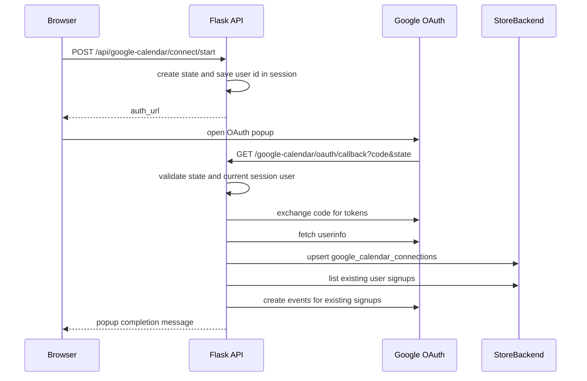

Calendar behavior:

- Requires Firebase/Google login; memory auth users cannot connect Google Calendar.
- Uses the OAuth scope `https://www.googleapis.com/auth/calendar.events`.
- Stores one connection per user.
- Refreshes access tokens when expired.
- Creates events on signup creation.
- Updates events when signups are reconfirmed or changed.
- Deletes events when signups are cancelled, waitlisted, expired, disconnected, or account deletion removes linked records.
- `google_calendar_event_links` prevents duplicate calendar event creation for a signup.

Failure handling:

- Google API failures are converted to `AuthError` with 502-style status codes.
- Calendar sync failures are logged around business operations so the primary signup or management action can complete.

## 13. Frontend Architecture

The frontend is a server-rendered shell plus modular vanilla JavaScript.

Important files:

- `frontend/templates/home.html`: public landing page.
- `frontend/templates/privacy.html`: public privacy page.
- `frontend/templates/terms.html`: public terms page.
- `frontend/templates/dashboard.html`: authenticated dashboard shell.
- `frontend/static/js/api-helpers.js`: shared `fetch()` wrapper and button-lock helpers.
- `frontend/static/js/auth.js`: auth boot, memory login, Firebase login, Google signup.
- `frontend/static/js/dashboard.js`: dashboard state, role-based UI, forms, modals, event binding.
- `frontend/static/js/admin-functions.js`: pantry and admin API wrappers.
- `frontend/static/js/lead-functions.js`: shift, role, attendance, and help-broadcast API wrappers.
- `frontend/static/js/volunteer-functions.js`: volunteer signup, cancellation, reconfirmation, pantry subscription helpers.
- `frontend/static/js/calendar-functions.js`: shared calendar controllers for available shifts and my shifts.
- `frontend/static/js/timezone-helpers.js`: browser timezone detection and local display formatting.
- `frontend/static/js/user-functions.js`: user profile, roles, calendar status, account APIs.

Frontend boot sequence:

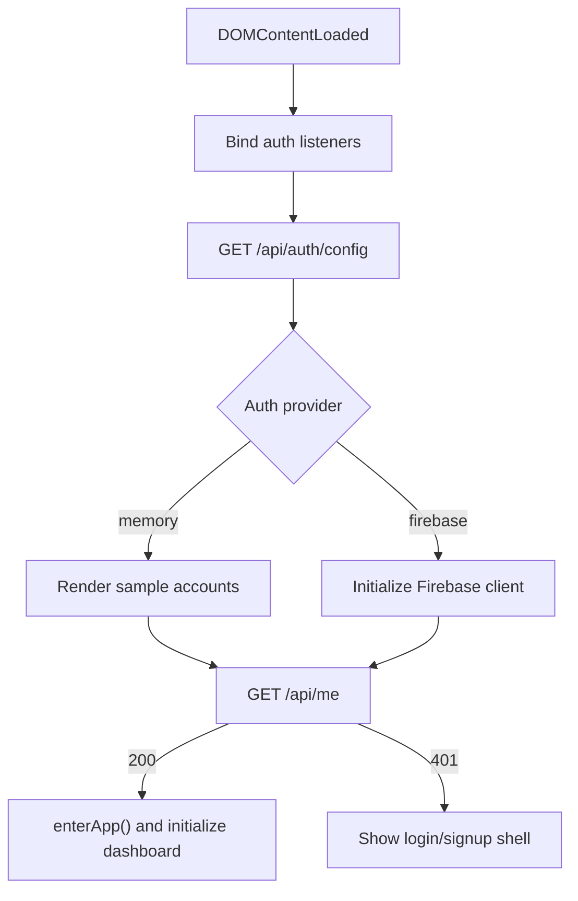

Dashboard behavior:

- A single dashboard shell adapts based on `currentUser.roles`.
- Role-based views are toggled in JavaScript instead of separate page routes.
- API calls use same-origin cookies and include the browser timezone header.
- Button locking prevents duplicate form submissions.
- Calendar controllers normalize backend shift payloads into reusable event models.
- Mobile and desktop views are managed in the same dashboard module.

## 14. API Surface Summary

### Authentication and Account

- `GET /api/auth/config`
- `POST /api/auth/login/memory`
- `POST /api/auth/login/google`
- `POST /api/auth/signup/google`
- `POST /api/auth/logout`
- `GET /api/me`
- `PATCH /api/me`
- `POST /api/me/email-change/prepare`
- `DELETE /api/me`

### Google Calendar

- `GET /api/google-calendar/status`
- `POST /api/google-calendar/connect/start`
- `POST /api/google-calendar/disconnect`
- `GET /google-calendar/oauth/callback`

### Users and Roles

- `GET /api/users`
- `GET /api/users/{user_id}`
- `GET /api/users/{user_id}/signups`
- `GET /api/roles`
- `POST /api/users`
- `PATCH /api/users/{user_id}/roles`

### Pantries

- `GET /api/pantries`
- `GET /api/all_pantries`
- `GET /api/volunteer/pantries`
- `GET /api/pantries/{pantry_id}`
- `POST /api/pantries`
- `PATCH /api/pantries/{pantry_id}`
- `DELETE /api/pantries/{pantry_id}`
- `POST /api/pantries/{pantry_id}/leads`
- `DELETE /api/pantries/{pantry_id}/leads/{lead_id}`
- `POST /api/pantries/{pantry_id}/subscribe`
- `DELETE /api/pantries/{pantry_id}/subscribe`

### Shifts and Roles

- `GET /api/pantries/{pantry_id}/shifts`
- `GET /api/pantries/{pantry_id}/active-shifts`
- `GET /api/calendar/shifts`
- `POST /api/pantries/{pantry_id}/shifts`
- `POST /api/pantries/{pantry_id}/shifts/full-create`
- `GET /api/shifts/{shift_id}`
- `GET /api/shifts/{shift_id}/registrations`
- `PATCH /api/shifts/{shift_id}`
- `PUT /api/shifts/{shift_id}/full-update`
- `DELETE /api/shifts/{shift_id}`
- `POST /api/shifts/{shift_id}/cancel`
- `POST /api/shifts/{shift_id}/roles`
- `PATCH /api/shift-roles/{shift_role_id}`
- `DELETE /api/shift-roles/{shift_role_id}`

### Signups and Attendance

- `POST /api/shift-roles/{shift_role_id}/signup`
- `GET /api/shift-roles/{shift_role_id}/signups`
- `DELETE /api/signups/{signup_id}`
- `PATCH /api/signups/{signup_id}/reconfirm`
- `PATCH /api/signups/{signup_id}/attendance`
- `PATCH /api/signups/{signup_id}`

### Help Broadcast

- `GET /api/shifts/{shift_id}/help-broadcast/candidates`
- `POST /api/shifts/{shift_id}/help-broadcast`

### Public

- `GET /api/public/pantries`
- `GET /api/public/pantries/{slug}/shifts`
- `GET /`
- `GET /privacy`
- `GET /terms`
- `GET /term`
- `GET /healthz`
- `GET /dashboard`

## 15. Configuration Reference

Primary environment variables:

| Variable | Purpose |
| --- | --- |
| `APP_ENV` | Runtime environment. `production` enables production defaults. |
| `FLASK_SECRET_KEY` | Flask session signing key. Required in production. |
| `SESSION_COOKIE_SECURE` | Whether session cookies require HTTPS. Defaults to production-aware behavior. |
| `TRUST_REVERSE_PROXY` | Enables `ProxyFix` for deployments behind a proxy. |
| `PREFERRED_URL_SCHEME_HTTPS` | Makes generated external URLs prefer HTTPS. |
| `CORS_ALLOWED_ORIGINS` | Comma-separated allowed origins for API CORS. |
| `AUTH_PROVIDER` | `memory` or `firebase`. |
| `DATA_BACKEND` | `mysql` or memory fallback. |
| `MYSQL_HOST` | MySQL host. |
| `MYSQL_PORT` | MySQL port. |
| `MYSQL_DATABASE` | MySQL database name. |
| `MYSQL_USER` | MySQL user. |
| `MYSQL_PASSWORD` | MySQL password. |
| `MYSQL_POOL_SIZE` | MySQL connection pool size. |
| `MYSQL_CONNECT_TIMEOUT` | MySQL connection timeout. |
| `SEED_MYSQL_FROM_JSON_ON_EMPTY` | Seeds MySQL from JSON if runtime tables are empty. |
| `RESEND_API_KEY` | Resend API key for email. |
| `RESEND_FROM_EMAIL` | Sender email for notifications. |
| `FIREBASE_*` | Firebase browser and admin settings. |
| `GOOGLE_OAUTH_CLIENT_ID` | Google OAuth client ID for Calendar sync. |
| `GOOGLE_OAUTH_CLIENT_SECRET` | Google OAuth client secret. |
| `GOOGLE_OAUTH_REDIRECT_URI` | Calendar OAuth redirect URI. |

Local MySQL can be started with `docker-compose.yml`, which runs MySQL 8.4 on port `3306` with the default development database and user credentials.

## 16. Security and Data Protection Considerations

Current safeguards:

- Server-side session cookies are HTTP-only.
- Production can enforce secure cookies and HTTPS URL generation.
- Reverse-proxy trust is opt-in.
- API authentication is enforced centrally for most `/api/*` routes.
- Role and pantry-lead checks are enforced server-side.
- Users can only sign themselves up for volunteer shifts.
- Protected super admin role restrictions prevent accidental loss of top-level access.
- Firebase ID tokens are verified server-side.
- Google Calendar OAuth state is session-bound to mitigate CSRF-style callback misuse.
- Account deletion removes external Firebase identity before local user deletion.

Important operational requirements:

- Use a strong `FLASK_SECRET_KEY` in production.
- Use HTTPS in production when Firebase, Google OAuth, and secure cookies are enabled.
- Restrict `CORS_ALLOWED_ORIGINS` in production if cross-origin browser access is needed.
- Keep Firebase admin credentials and Resend keys out of source control.
- Use a verified Resend sending domain.
- Register the exact Google OAuth redirect URI used by the deployed app.

## 17. Concurrency and Consistency

Critical write paths are transaction-aware in the MySQL backend.

Concurrency-sensitive areas:

- Signup creation.
- Reconfirmation after capacity changes.
- Full shift and role replacement.
- Capacity recalculation.

Expected guarantees:

- Duplicate signup to the same role is blocked by a database unique constraint.
- Signup creation locks the target role and checks capacity inside the transaction.
- Reconfirmation locks the signup and role context so reduced capacity is claimed consistently.
- Full shift updates replace shift and role data in one backend operation, reducing partial-update risk.

Known tradeoffs:

- Email and Google Calendar side effects are not part of the database transaction.
- If an external provider fails after the local write succeeds, the local state remains the source of truth and the failure is logged.
- The migration files are idempotent baseline schema files, not a full historical migration ledger with down migrations.

## 18. Testing Strategy

The test suite covers the system at several layers:

- Backend contract tests for abstract interfaces.
- Memory backend behavior tests.
- MySQL component tests for schema, CRUD, signups, recurrence, and cascades.
- Auth service tests for memory and Firebase behavior.
- Route tests for API permission rules and business workflows.
- Notification helper and component tests with Resend blocked unless explicitly mocked.
- Google Calendar sync tests with HTTP/provider calls mocked.
- Signup rate-limit tests.
- Help broadcast tests.
- Application configuration and public page tests.

Test environment defaults:

- `DATA_BACKEND=memory`
- `AUTH_PROVIDER=memory`
- `FLASK_SECRET_KEY=test-secret-key`
- Resend sending is replaced with a blocked test stub so tests cannot accidentally call the real API.

Representative test files:

- `tests/test_routes.py`
- `tests/test_backends.py`
- `tests/test_google_calendar_sync.py`
- `tests/test_notifications.py`
- `tests/test_signup_rate_limit.py`
- `tests/test_help_broadcast.py`
- `tests/component/test_db_component.py`
- `tests/component/test_auth_component.py`
- `tests/component/test_notifications_component.py`

## 19. Deployment Shape

The application is designed to run as a Flask web process backed by MySQL.

Production deployment concerns:

- Provide a production `.env` or equivalent platform environment variables.
- Set `APP_ENV=production`.
- Set a strong `FLASK_SECRET_KEY`.
- Use `DATA_BACKEND=mysql`.
- Run MySQL with durable storage.
- Configure Firebase if Google sign-in is the production auth mode.
- Configure Google OAuth for Calendar sync if enabled.
- Configure Resend and a verified sender domain for email.
- Enable reverse-proxy trust only when the application is actually behind a trusted proxy.
- Ensure `/`, `/privacy`, `/terms`, and `/google-calendar/oauth/callback` are reachable for Google verification and OAuth.

The `/healthz` endpoint returns `{"status": "ok"}` and is suitable for basic platform health checks.

## 20. Extension Points

Backend extension points:

- Add storage behavior by extending `StoreBackend` and implementing both MySQL and memory methods.
- Add auth providers by implementing `AuthService` and updating `auth/factory.py`.
- Add email scenarios in `notifications/notifications.py` and keep route handlers responsible only for deciding when to notify.
- Add external calendar behavior in `google_calendar.py` while keeping local signup state authoritative.

Frontend extension points:

- Add API wrapper functions to the relevant `*-functions.js` module.
- Add dashboard UI state and rendering to `dashboard.js`.
- Reuse `api-helpers.js` for same-origin API calls and button locking.
- Reuse `timezone-helpers.js` for all user-visible date and time formatting.
- Reuse `calendar-functions.js` for shift-calendar visualizations instead of creating a second calendar model.

Database extension points:

- Add schema changes under `backend/db/migrations/`.
- Update both `mysql_backend.py` and `memory_backend.py` for new backend contract behavior.
- Update seed data only when new fields need representative local or test fixtures.

## 21. Current System Boundaries

In scope:

- Pantry, user, lead, shift, role, signup, attendance, subscription, notification, and calendar-sync workflows.
- Public pantry and shift visibility.
- Authenticated dashboard for multiple role types.
- MySQL persistence and memory-mode test/dev operation.

Out of scope in the current codebase:

- Multi-tenant organization isolation beyond pantries and roles.
- Background job queue for retries.
- Full migration rollback framework.
- Real-time websocket updates.
- Payment or donation workflows.
- Native mobile app.

## 22. Operational Runbook Snapshot

Local development:

1. Create `backend/.env` from `backend/env.example`.
2. Start MySQL with `docker-compose.yml` if using `DATA_BACKEND=mysql`.
3. Run the Flask app from `backend/app.py`.
4. Open `/dashboard`.
5. In memory auth mode, use the rendered sample accounts.

Common checks:

- If login fails in Firebase mode, verify Firebase browser config and admin credentials.
- If Google Calendar connect fails, verify OAuth client ID, secret, redirect URI, and callback reachability.
- If emails do not send, verify `RESEND_API_KEY`, `RESEND_FROM_EMAIL`, and Resend domain verification.
- If data does not appear in MySQL, confirm `DATA_BACKEND=mysql`, credentials, and whether seed-on-empty ran.
- If production sessions fail behind a proxy, verify HTTPS, `SESSION_COOKIE_SECURE`, and `TRUST_REVERSE_PROXY`.

## 23. Architectural Summary

The system is intentionally centralized: Flask owns orchestration, the backend interface owns persistence contracts, and the frontend owns role-aware dashboard behavior in a single browser app. This keeps the project approachable while still separating the parts that need clear boundaries: authentication, storage, notifications, calendar integration, and UI API wrappers.

The most important invariant is that local database state remains the source of truth. Notifications and Google Calendar events are derived side effects. When external integrations fail, the app logs the issue and preserves the core scheduling operation whenever possible.
