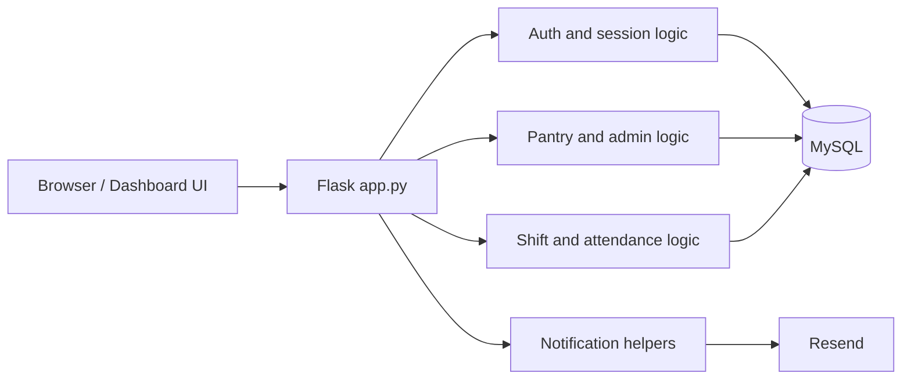

# Transfer Documentation

This document captures key technical details about the backend data model, concurrency safety, recurring shift handling, pantry subscriptions, and file roles to help onboard new developers and preserve institutional knowledge. It also includes a table of contents for easy navigation. The goal is to provide a comprehensive reference for understanding the architecture and design decisions behind the volunteer management system.

## Table of Contents

- A. System design 
  - Current architecture
  - Service boundaries
  - Microservice migration plan
- B. Backend
  - I. Backends
    - base.py
    - factory.py
    - memory_backend.py
    - mysql_backend.py
  - II. Data
    - mysql.json
    - in_memory.json
  - III. Database
    - 001_initial.sql
    - init_schema.py
    - mysql.py
    - seed.py
  - IV. Notifications
    - notifications.py
  - V. app.py
- C. Frontend
  - I. css
    - dashboard.css
  - II. js
    - admin-functions.js
    - api-helpers.js
    - dashboard.js
    - lead-functions.js
    - timezone-helpers.js
    - user-functions.js
    - volunteer-functions.js
  - III. templates
    - dashboard.html

---

# A. System design

## Current architecture

The application is a modular monolith today:

- One Flask backend (`backend/app.py`) serves both the REST API and the dashboard UI.
- One browser-based frontend (`frontend/templates/dashboard.html` + `frontend/static/js/*.js`) manages all tab state and calls the API.
- One shared relational data store persists users, pantries, shifts, roles, signups, subscriptions, and notifications.
- Backend modules are already separated by domain, which makes later service extraction feasible without rewriting the UI first.

High-level runtime shape:

Core responsibilities:

- `dashboard.js` bootstraps the UI, applies role-based tab visibility, and coordinates manage-shifts/admin-pantry interactions.
- `app.py` owns the request lifecycle, permission checks, and API orchestration.
- `mysql_backend.py` is the primary persistence layer for production data.
- `notifications.py` handles outbound email formatting and delivery.

## Service boundaries

Even though the app is deployed as one backend today, the code already groups by business capability:

- Identity and account management
  - users, roles, current-user session, timezone persistence, account changes
- Pantry administration
  - pantry CRUD, pantry leads, pantry subscription directory, pantry-specific views
- Shift scheduling
  - shift creation and edits, recurring series, capacity rules, role filling, cancellations
- Attendance and reliability
  - attendance marking, signup states, reservation windows, attendance score updates
- Notifications
  - signup confirmation, shift update/cancellation, new-shift subscriber emails, help broadcasts

Recommended ownership model if the backend is split later:

- Identity service owns `users` and `user_roles`.
- Pantry service owns `pantries`, `pantry_leads`, and `pantry_subscriptions`.
- Shift service owns `shift_series`, `shifts`, `shift_roles`, and `shift_signups`.
- Notification service owns outbound email templates, throttling, and delivery history.
- Frontend stays mostly unchanged and talks to a gateway or BFF.

## Microservice migration plan

This codebase should move to microservices in phases, not by a big-bang rewrite.

### Phase 1: prepare the monolith for extraction

- Keep the current UI and route contract stable.
- Introduce explicit domain service classes or modules behind the existing Flask routes.
- Stop sharing domain logic directly across routes; route handlers should call a service boundary.
- Add correlation/request IDs in logs so future service calls are traceable.
- Make notification delivery and database writes easier to observe with structured logging.

### Phase 2: extract read-heavy services first

Best first candidates are the least coupled, mostly read-only flows:

- Pantry directory service for public pantry data and subscription state.
- Notification service for outbound email rendering and send throttling.
- Admin lookup service for role and user search.

These can be extracted behind the current API without changing the dashboard behavior.

### Phase 3: split the shift domain

Shift management is the core business area and should be extracted next:

- Shift service owns shift lifecycle, recurring series, roles, signups, and capacity recalculation.
- Attendance endpoints move with the shift service because they depend on signup state.
- The service should publish events when shifts are created, updated, cancelled, or when attendance changes.

### Phase 4: introduce an API gateway or BFF

- Add a gateway in front of the services so the frontend still sees one logical API.
- Let the gateway handle auth/session translation, request routing, and cross-service aggregation.
- Keep the dashboard on the current contract as much as possible while the backend changes underneath it.

### Phase 5: decouple data stores

- Give each service its own schema or database.
- Remove direct cross-service SQL joins.
- Replace synchronous cross-domain writes with events or dedicated API calls.
- Treat MySQL as a per-service implementation detail instead of one shared database.

### Phase 6: harden operations

- Add health checks, metrics, and alerts per service.
- Add message retries and dead-letter handling for notification work.
- Add integration tests for the gateway and service contracts.
- Add deployment automation so services can be rolled out independently.

### Suggested end-state services

- Identity service
- Pantry service
- Shift service
- Attendance service if attendance grows beyond the shift domain
- Notification service
- Admin/reporting service if analytics becomes separate from operational flows

### Tradeoffs to expect

- More operational complexity: networking, retries, tracing, and deployments become mandatory.
- More data consistency work: signups and capacity checks need transactional boundaries or event-driven compensation.
- Better independent scaling: notifications, pantry search, and shift operations can scale separately.
- Clearer ownership: each team can ship one domain without touching the whole backend.

### Recommended migration rule

Do not extract a service until the boundary is stable, the contracts are covered by tests, and the data ownership is clear.

In practice, the safest order is:

1. Stabilize current modules behind clean internal services.
2. Extract notifications.
3. Extract pantry/read-heavy endpoints.
4. Extract shift management.
5. Introduce a gateway.
6. Split databases.

That approach keeps the existing dashboard working while the architecture evolves.

---

# B. Backend

## I. Backends

### 1. base.py

**Purpose:**  
Defines StoreBackend, the abstract interface every data backend (MySQL, in-memory, etc.) must implement for users, roles, pantries, shifts, roles, signups, and seed checks. No logic here—only contracts.

**Functions (all @abstractmethod; subclasses must implement):**

- `get_user_by_id(user_id:int) -> dict|None`  
  Fetch a single user by id.

- `get_user_roles(user_id:int) -> list[str]`  
  Return role names assigned to a user.

- `list_users(role_filter:str|None=None) -> list[dict]`  
  List users; optionally only those having role_filter.

- `list_roles() -> list[dict]`  
  List available role records.

- `get_user_by_email(email:str) -> dict|None`  
  Fetch a user by normalized email.

- `get_user_by_auth_uid(auth_uid:str) -> dict|None`  
  Fetch a user by linked Firebase UID.

- `create_user(full_name, email, phone_number, roles:list[str], timezone=None, auth_provider=None, auth_uid=None) -> dict`  
  Create user and assign given role names.

- `update_user(user_id:int, payload:dict) -> dict|None`  
  Update allowed user fields such as name, phone, timezone, email, and auth linkage.

- `delete_user(user_id:int) -> None`  
  Delete a local user. Signups and pantry-lead links cascade; shift ownership becomes nullable in SQL.

- `list_pantries() -> list[dict]`  
  List all pantries.

- `get_pantry_by_id(pantry_id:int) -> dict|None`  
  Get pantry by id.

- `get_pantry_by_slug(slug:str) -> dict|None`  
  Get pantry by slug or id-like string.

- `get_pantry_leads(pantry_id:int) -> list[dict]`  
  Users who lead the pantry.

- `is_pantry_lead(pantry_id:int, user_id:int) -> bool`  
  Whether user is lead of pantry.

- `create_pantry(name:str, location_address:str, lead_ids:list[int]) -> dict`  
  Create pantry and attach leads.

- `add_pantry_lead(pantry_id:int, user_id:int) -> None`  
  Add a lead to a pantry.

- `remove_pantry_lead(pantry_id:int, user_id:int) -> None`  
  Remove a lead from a pantry.

- `list_shifts_by_pantry(pantry_id:int, include_cancelled:bool=True) -> list[dict]`  
  Shifts for a pantry; optionally hide cancelled.

- `get_shift_by_id(shift_id:int) -> dict|None`  
  Get a shift.

- `list_shifts_by_series(shift_series_id:int) -> list[dict]`  
  List concrete shift rows belonging to one recurring series.

- `get_shift_series_by_id(shift_series_id:int) -> dict|None`  
  Fetch one recurring series record.

- `create_shift_series(payload:dict) -> dict`  
  Create the recurring-series metadata row used by recurring weekly shifts.

- `update_shift_series(shift_series_id:int, payload:dict) -> dict|None`  
  Update recurring-series metadata.

- `create_shift(pantry_id:int, shift_name:str, start_time:str, end_time:str, status:str, created_by:int, shift_series_id=None, series_position=None) -> dict`  
  Create shift record, optionally linked to a recurring series.

- `update_shift(shift_id:int, payload:dict) -> dict|None`  
  Update allowed fields of a shift.

- `delete_shift(shift_id:int) -> None`  
  Remove a shift (and dependent data as backend decides).

- `list_shift_roles(shift_id:int) -> list[dict]`  
  Roles/positions for a shift.

- `get_shift_role_by_id(shift_role_id:int) -> dict|None`  
  Get one shift role.

- `create_shift_role(shift_id:int, role_title:str, required_count:int) -> dict`  
  Create a role in a shift.

- `update_shift_role(shift_role_id:int, payload:dict) -> dict|None`  
  Update role fields (title/count/status/etc.).

- `delete_shift_role(shift_role_id:int) -> None`  
  Delete a shift role.

- `list_shift_signups(shift_role_id:int) -> list[dict]`  
  Signups for a shift role.

- `list_signups_by_user(user_id:int) -> list[dict]`  
  All signups by a user.

- `get_signup_by_id(signup_id:int) -> dict|None`  
  Get one signup.

- `create_signup(shift_role_id:int, user_id:int, signup_status:str) -> dict`  
  Create a signup with a given status.

- `delete_signup(signup_id:int) -> None`  
  Remove a signup.

- `update_signup(signup_id:int, signup_status:str) -> dict|None`  
  Change signup status.

- `bulk_mark_shift_signups_pending(shift_id:int, reservation_expires_at:str) -> list[dict]`  
  Bulk move non-cancelled/non-waitlisted signups to `PENDING_CONFIRMATION` and reset 48-hour reservations.

- `expire_pending_signups(shift_id:int, now_utc:str) -> int`  
  Auto-cancel expired or started-shift pending reservations.

- `reconfirm_pending_signup(signup_id:int, now_utc:str) -> dict`  
  Atomic reconfirm for first-come-first-serve after edits and count reductions.

- `is_empty() -> bool`  
  Whether backend has no users/roles (used to decide seeding).

---

### 2. factory.py

**Purpose:**  
Pick and initialize the data backend based on environment settings; set up schema/seed when using MySQL, otherwise use the in-memory backend.

**Function**

- `create_backend() -> StoreBackend`

Behavior:

- Reads `DATA_BACKEND` (default `"mysql"`, case-insensitive).

If value is `"mysql"`:

- Imports `MySQLBackend`
- Runs `db.init_schema.init_schema()` to ensure tables exist
- Instantiates `MySQLBackend()`

If env `SEED_MYSQL_FROM_JSON_ON_EMPTY` is `"true"` (default) and the DB reports empty via `backend.is_empty()`:

- Loads seed data from `data/mysql.json` using `db.seed.seed_mysql_from_json`
- The current MySQL seed includes a much larger set of future `OPEN` shifts so calendar and signup UI flows have denser mock coverage in dev

Returns the MySQL backend instance.

For any other `DATA_BACKEND` value:

- Returns `MemoryBackend()`  
  (which will self-seed from `data/in_memory.json` if that file exists)

---

### 3. memory_backend.py

**Purpose:**  
Dev/demo datastore kept in Python dicts, optionally seeded from `data/in_memory.json`. Tracks incremental IDs and keeps role capacities in sync.

**Internal helpers & setup**

- `_utc_now_iso() -> str`  
  Current UTC timestamp (ISO, ends with Z) for created/updated fields.

- `_copy(row) -> dict|None`  
  Shallow-copy a record so callers can’t mutate stored data; returns None if given None.

- `_recalculate_role_capacity(shift_role_id) -> None`  
  Counts occupied slots for a role (active statuses plus unexpired `PENDING_CONFIRMATION` reservations), updates `filled_count`, and sets role status to FULL when filled ≥ required, else OPEN (skips status change if role is CANCELLED).

- `_load_seed_data() -> None`  
  If `data/in_memory.json` exists, loads tables from it and sets `next_*` ID counters to max existing + 1.

- `__init__(data_path=None)`  
  Initializes empty tables and ID counters (start at 1); sets seed path (default `data/in_memory.json`); then seeds via `_load_seed_data()`.

---

**User & role methods**

- `get_user_by_id(user_id) -> dict|None`  
  Finds user by id; returns copy or None.

- `get_user_roles(user_id) -> list[str]`  
  Resolves role names linked to the user via `user_roles`.

- `list_users(role_filter=None) -> list[dict]`  
  All users (copies); if role_filter, only users who have that role.

- `list_roles() -> list[dict]`  
  All role records (copies).

- `get_user_by_email(email) -> dict|None`  
  Finds a user by normalized email.

- `get_user_by_auth_uid(auth_uid) -> dict|None`  
  Finds a user by linked Firebase UID.

- `create_user(full_name, email, phone_number, roles, timezone=None, auth_provider=None, auth_uid=None) -> dict`  
  Raises `ValueError` if email or auth UID already exists; creates the user with timestamps, optional saved timezone, and optional Firebase linkage; links any requested roles that already exist; returns the created user with the roles it actually assigned.

- `update_user(user_id, payload) -> dict|None`  
  Updates allowed user fields, including `timezone`, and refreshes `updated_at`.

- `delete_user(user_id) -> None`  
  Removes the user and related join/sign-up records; in memory mode any `created_by` shift references are set to `None`.

---

**Pantry & lead methods**

- `list_pantries() -> list[dict]`
- `get_pantry_by_id(pantry_id) -> dict|None`
- `get_pantry_by_slug(slug) -> dict|None`
- `get_pantry_leads(pantry_id) -> list[dict]`
- `is_pantry_lead(pantry_id, user_id) -> bool`
- `create_pantry(name, location_address, lead_ids) -> dict`
- `add_pantry_lead(pantry_id, user_id) -> None`
- `remove_pantry_lead(pantry_id, user_id) -> None`

---

**Shift methods**

- `list_shifts_by_pantry(pantry_id, include_cancelled=True)`
- `get_shift_by_id(shift_id)`
- `create_shift(pantry_id, shift_name, start_time, end_time, status, created_by)`
- `update_shift(shift_id, payload)`
- `delete_shift(shift_id)`

---

**Shift role methods**

- `list_shift_roles(shift_id)`
- `get_shift_role_by_id(shift_role_id)`
- `create_shift_role(shift_id, role_title, required_count)`
- `update_shift_role(shift_role_id, payload)`
- `delete_shift_role(shift_role_id)`

---

**Signup methods**

- `list_shift_signups(shift_role_id)`
- `list_signups_by_user(user_id)`
- `get_signup_by_id(signup_id)`
- `create_signup(shift_role_id, user_id, signup_status)`
- `delete_signup(signup_id)`
- `update_signup(signup_id, signup_status)`
- `bulk_mark_shift_signups_pending(shift_id, reservation_expires_at)`
- `expire_pending_signups(shift_id, now_utc)`
- `reconfirm_pending_signup(signup_id, now_utc)`

---

**Utility**

- `is_empty() -> bool`  
  True when both users and roles tables are empty (used by factory to decide seeding).

---

### 4. mysql_backend.py

**Purpose:**  
Production data layer using MySQL. Implements all `StoreBackend` methods (users, roles, pantries, shifts, roles, signups) with SQL, enforces business rules (unique email, not signing up twice, capacity limits, cancelled items), and keeps each role’s `filled_count/status` accurate.

**Internal helpers & setup**

- `_now_utc_naive()`  
  Current UTC datetime without timezone for `DATETIME` columns.

- `_parse_iso_to_dt(value)`  
  ISO string (accepts Z) → naive UTC datetime.

- `_to_iso_z(value)`  
  Datetime → ISO string ending with Z.

- `_serialize_*` functions  
  Convert database rows to API dictionaries with ISO timestamps and correct types.

- `_recalculate_role_capacity(cursor, shift_role_id)`  
  Counts occupied slots (`CONFIRMED/SHOW_UP/NO_SHOW` + unexpired `PENDING_CONFIRMATION` reservations), updates `filled_count`, and sets role status to `FULL` or `OPEN` unless role is already `CANCELLED`.

---

**User & role methods**

- `get_user_by_id(user_id)`  
  Select user and serialize.

- `get_user_roles(user_id)`  
  Return role names assigned to the user.

- `list_users(role_filter=None)`  
  Return all users or filter by role.

- `list_roles()`  
  Return all role records.

- `create_user(...)`  
  Insert user. Duplicate email raises `ValueError`. Links roles if they exist.

---

**Pantry & lead methods**

- `list_pantries()`
- `get_pantry_by_id(id)`
- `get_pantry_by_slug(slug)`
- `get_pantry_leads(pantry_id)`
- `is_pantry_lead(pantry_id, user_id)`
- `create_pantry(name, address, lead_ids)`
- `add_pantry_lead(pantry_id, user_id)`
- `remove_pantry_lead(pantry_id, user_id)`

---

**Shift methods**

- `list_shifts_by_pantry(pantry_id, include_cancelled=True)`
- `get_shift_by_id(shift_id)`
- `create_shift(...)`
- `update_shift(shift_id, payload)`
- `delete_shift(shift_id)`

---

**Shift role methods**

- `list_shift_roles(shift_id)`
- `get_shift_role_by_id(id)`
- `create_shift_role(shift_id, title, required_count)`
- `update_shift_role(shift_role_id, payload)`
- `delete_shift_role(shift_role_id)`

---

**Signup methods**

- `list_shift_signups(shift_role_id)`
- `list_signups_by_user(user_id)`
- `get_signup_by_id(signup_id)`
- `create_signup(shift_role_id, user_id, signup_status)`
- `delete_signup(signup_id)`
- `update_signup(signup_id, signup_status)`
- `bulk_mark_shift_signups_pending(shift_id, reservation_expires_at)`
- `expire_pending_signups(shift_id, now_utc)`
- `reconfirm_pending_signup(signup_id, now_utc)`

Signup creation occurs in a transaction:

1. Lock the shift role row
2. Ensure role and shift exist and are not cancelled
3. Check duplicate signup
4. Check reservation-aware role occupancy (confirmed/attendance + unexpired pending reservations)
5. Insert signup
6. Recalculate role capacity
7. Commit transaction

Possible errors:

- `LookupError` – missing role or shift
- `RuntimeError` – role cancelled or full
- `ValueError` – duplicate signup

Pending reconfirmation is also transactional:

1. Lock signup + role rows
2. Reject/expire when reservation elapsed or shift started
3. Confirm first-come-first-serve against current confirmed count
4. Move to WAITLISTED when reduced capacity has no room

---

## II. Data

### 1. mysql.json and in_memory.json

**Purpose:**  
Seed datasets for development and demos. They pre-populate every table the backends expect so the app has realistic data without manual entry.

Current split:

- `backend/data/mysql.json` seeds the MySQL backend and now includes a much larger future mock shift schedule for calendar and signup testing.
- `backend/data/in_memory.json` seeds the in-memory backend.

Contains:

**users**

- 24 sample users
- id
- full name
- email
- optional Firebase linkage (`auth_provider`, `auth_uid`)
- attendance score
- created timestamps

**roles**

Four seeded system roles:

- SUPER_ADMIN (`role_id = 0`)
- ADMIN
- PANTRY_LEAD
- VOLUNTEER

**user_roles**

Maps users to roles.

Runtime note:

- the Admin Users flow enforces one editable system role per user
- the protected seeded `SUPER_ADMIN` account (`user_id = 1`) is fixed and not editable through the app

Examples:

- user 1 → SUPER_ADMIN
- some seeded users → PANTRY_LEAD
- others → VOLUNTEER

**pantries**

Five pantry locations with names and addresses.

**pantry_leads**

Links pantries to their lead users.

Example:

- pantry 1 → users 1 and 3

**shifts**

Scheduled volunteer shifts across pantries with:

- names
- start and end times
- status
- creator
- timestamps

**shift_roles**

Roles within each shift such as:

- Greeter
- Food Sorter

Includes:

- required_count
- filled_count
- status

**shift_signups**

Volunteer registrations including:

- shift role
- user
- signup status (`CONFIRMED`, `PENDING_CONFIRMATION`, `WAITLISTED`, `CANCELLED`, `SHOW_UP`, `NO_SHOW`)
- `reservation_expires_at` for the 48-hour reserved spot window after shift edits
- timestamps

Both the MySQL and memory backends can seed from this file.

---

## III. Database

### 1. 001_initial.sql

**Purpose:**  
Creates all MySQL tables used by the system with keys and constraints.

Tables defined:

**roles**

- List of possible roles
- seeded role ids are explicit; `SUPER_ADMIN` uses `role_id = 0`
- role names must be unique

**users**

- Stores all accounts
- unique email constraint
- optional Firebase linkage (`auth_provider`, `auth_uid`)
- attendance score
- timestamps

**user_roles**

- Mapping between users and roles
- composite key `(user_id, role_id)`
- cascade delete when user removed
- runtime admin UI treats users as having one editable system role at a time

**pantries**

- Food pantry locations
- name
- address
- timestamps

**pantry_leads**

- Connects users to pantries they lead
- cascade delete if pantry or user removed

**shifts**

- Volunteer shifts
- pantry reference
- shift name
- start and end times
- status
- creator
- timestamps

**shift_roles**

- Positions within shifts
- required_count
- filled_count
- status

**shift_signups**

- Volunteer registrations
- `signup_status` supports reconfirmation lifecycle (`PENDING_CONFIRMATION`, `WAITLISTED`, `CANCELLED`) plus attendance states
- `reservation_expires_at` stores reservation expiry for pending reconfirmations
- unique `(shift_role_id, user_id)`
- index on `(shift_role_id, signup_status, reservation_expires_at)` for reservation-aware occupancy checks
- cascade delete when role or user removed

---

### 2. init_schema.py

**Purpose:**  
Ensures the MySQL database exists and applies the schema file safely.

Functions:

`ensure_database_exists()`

- Attempts to create database if missing.
- Continues silently if the DB user lacks permission.

`_split_sql_statements(sql)`

- Splits large SQL scripts into statements
- avoids breaking inside comments or quotes

`apply_sql(sql)`

- Executes SQL script
- commits on success
- rolls back on failure

`init_schema()`

- Ensures database exists
- loads all SQL files from `migrations/` in filename order
- applies schema scripts

Script entrypoint:

Running: `python backend/db/init_schema.py` initializes the schema and prints a success message.

---

### 3. mysql.py

**Purpose:**  
Provides pooled MySQL connections and configuration helpers.

Functions:

`mysql_config(include_database=True)`

Builds connection settings from environment variables.

Default values:

- host `127.0.0.1`
- port `3306`
- user `volunteer_user`
- password `volunteer_pass`
- database `volunteer_managing`

`get_pool()`

- creates or returns a global MySQL connection pool
- pool size controlled by `MYSQL_POOL_SIZE`

`get_connection()`

- context manager
- returns connection from pool
- automatically closes when finished

`reset_pool()`

- clears connection pool cache

---

### 4. seed.py

**Purpose:**  
Populate MySQL tables using the dataset in `data/mysql.json`.

Functions:

`parse_iso_to_dt(value)`

- converts timestamp string to Python datetime

`seed_mysql_from_json(data_path, truncate=False)`

Process:

1. Load JSON dataset
2. Optionally truncate tables
3. Insert or update rows
4. Reset auto-increment counters

Supports running multiple times safely.

`should_seed_mysql()`

Returns `True` when:

- users table empty
- roles table empty

Used to decide whether seeding should occur.

---

## IV. Notifications

### 1. notifications.py

**Purpose:**  
Send volunteer notification emails through Resend without coupling the notification helper to Flask response objects.

**Setup and configuration**

- Loads `RESEND_API_KEY` and `RESEND_FROM_EMAIL` from `backend/.env`
- Uses a verified sender such as `noreply@updates.example.com`
- Expects the team to own the sending domain or subdomain and verify the DNS records in Resend before enabling delivery
- Uses Python `zoneinfo` to render shift times in the saved user timezone and falls back to `America/New_York`

**Key structures**

- `NotificationResult`
  - `ok`
  - `provider`
  - `code`
  - `message`
  - `recipient_email`
  - `subject`
  - `provider_response`

**Main helpers**

- `_parse_iso_datetime_to_utc(value) -> datetime|None`
- `_normalized_text(value, fallback) -> str`
- `_resolved_timezone_name(value) -> str`
- `_format_shift_window(shift, timezone_name=None) -> str`
- `_build_email_html(...) -> str`
- `_notification_result(...) -> NotificationResult`
- `_send_resend_email(params, recipient_email, subject, success_code, success_message) -> NotificationResult`
- `send_signup_confirmation(recipient, shift, pantry, role) -> NotificationResult`
- `send_shift_update_notification(recipient, shift, pantry, signups) -> NotificationResult`
- `send_shift_cancellation_notification(recipient, shift, pantry, signups) -> NotificationResult`

**Behavior**

- Builds a shared HTML email layout for 3 scenarios: signup confirmed, shift updated/reconfirm required, and shift cancelled.
- Converts UTC shift timestamps into the saved recipient timezone before rendering the email body.
- Returns structured success/failure metadata instead of `jsonify(...)`.
- Lets `app.py` decide how to log or ignore non-fatal email delivery problems.

---

## V. app.py

**Purpose:**  
Serve the dashboard UI and provide REST APIs for users, pantries, shifts, roles, signups, attendance, and public views.

---

### Helpers

Authentication and context:

- `set_current_user()`
- `find_user_by_id(user_id)`
- `get_user_roles(user_id)`
- `user_has_role(user_id, role_name)`
- `is_super_admin(user_id)`
- `is_admin_capable(user_id)`
- `current_user()`

Pantry helpers:

- `find_pantry_by_id(pantry_id)`
- `pantries_for_current_user()`
- `get_pantry_leads(pantry_id)`

Shift helpers:

- `get_shift_roles(shift_id)`
- `get_shift_signups(shift_role_id)`

Time helpers:

- `parse_iso_datetime_to_utc()`
- `is_upcoming_shift()`
- `shift_has_started()`
- `shift_has_ended()`

Notification helpers:

- `send_signup_confirmation_if_configured()`
- `send_shift_notifications_if_configured()`

Profile/timezone flows:

- `serialize_user_for_client()` includes `timezone`
- `PATCH /api/me` accepts `timezone`
- `POST /api/auth/signup/google` accepts optional `timezone`

Permission helpers:

- `ensure_shift_manager_permission()`
- `should_include_cancelled_shift_data()`

Capacity helpers:

- `recalculate_shift_role_capacity()`
- `recalculate_shift_capacities()`

Attendance helpers:

- `check_attendance_marking_allowed()`
- `set_attendance_status()`

---

### API Routes

**Users**

- `GET /api/me`
- `PATCH /api/me`
- `GET /api/users`
- `GET /api/users/<user_id>`
- `POST /api/users`
- `PATCH /api/users/<user_id>/roles`
- `GET /api/users/<user_id>/signups`
- `GET /api/roles`

**Pantries**

- `GET /api/pantries`
- `GET /api/all_pantries`
- `GET /api/pantries/<id>`
- `GET /api/volunteer/pantries`
- `POST /api/pantries/<id>/subscribe`
- `DELETE /api/pantries/<id>/subscribe`
- `POST /api/pantries`
- `POST /api/pantries/<id>/leads`
- `DELETE /api/pantries/<id>/leads/<lead_id>`

**Shifts**

- `GET /api/pantries/<pantry_id>/shifts`
- `POST /api/pantries/<pantry_id>/shifts`
- `POST /api/pantries/<pantry_id>/shifts/full-create`
- `GET /api/shifts/<shift_id>`
- `PATCH /api/shifts/<shift_id>`
- `PUT /api/shifts/<shift_id>/full-update`
- `DELETE /api/shifts/<shift_id>`
- `POST /api/shifts/<shift_id>/cancel`

**Shift roles**

- `POST /api/shifts/<shift_id>/roles`
- `PATCH /api/shift-roles/<shift_role_id>`
- `DELETE /api/shift-roles/<shift_role_id>`

**Signups**

- `POST /api/shift-roles/<shift_role_id>/signup`
- `GET /api/shift-roles/<shift_role_id>/signups`
- `DELETE /api/signups/<signup_id>`
- `PATCH /api/signups/<signup_id>/reconfirm`
- `PATCH /api/signups/<signup_id>/attendance`

**Public routes**

- `GET /api/public/pantries`
- `GET /api/public/pantries/<slug>/shifts`

---

Running `backend/app.py` directly starts the Flask development server on port `5000`.

# C. Frontend

## I. css

### 1. dashboard.css

Purpose:  
Defines the full look-and-feel for the dashboard: layout, navigation tabs, cards, forms, tables, shift cards, badges, buttons, loading states, responsive tweaks.

Highlights by section:

Global reset and base:

- zero margins/padding
- border-box sizing
- system UI fonts
- light gray background

Header:

- purple gradient banner
- flex layout for title and user info
- subtle shadow

Navigation tabs:

- horizontal tabs with active and hover states
- hideable tabs for role-based UI

Manage-shifts subtabs:

- pill-like toggles
- show and hide subcontent areas

Main content:

- centered layout
- max-width container
- fade-in animation when tab content changes

Cards:

- white panels
- rounded corners
- shadow
- section header styling

Forms:

- responsive grid
- labeled inputs
- select and textarea styling
- focus highlights

Buttons:

- primary gradient
- secondary gray
- success green
- danger red
- hover lift and shadow
- disabled states

Tables:

- responsive containers
- styled headers and rows
- hover highlight
- shift action button row styling

Registrations view:

- bordered blocks
- role grids
- volunteer list with attendance action buttons
- status tags
- open/closed attendance window colors

"My Shifts" view:

- default calendar subview plus toggle back to list
- animated view toggle pill
- reusable calendar shell scoped to the volunteer tab
- list toolbar with volunteer-facing search, pantry filter, and time-bucket filter
- card grid in list mode
- status and attendance badges
- meta text
- action buttons
- reconfirm notes
- credibility summary panel

Messages:

- success alerts
- error alerts
- info alerts
- slide-down animation

Shift cards (calendar/public view):

- grid of cards
- hover lift effect
- role capacity bars
- status chips
- progress bar gradient
- capacity color coding

Loading state:

- spinner animation
- muted loading text

Pantry selector bar:

- white strip
- drop shadow
- styled select input

Responsive rules (≤768px):

- stacked header and navigation
- single-column grids
- vertical action buttons
- mobile spacing adjustments
- volunteer `Pantries` tab expands the selected pantry inline in the list instead of relying on the desktop side panel

---

## II. js

### 1. admin-functions.js

Purpose:  
Front-end helper functions for admins and leads to manage pantries, leads, and roles.

Note:

- user search/profile/role editing now lives in `dashboard.js` + `user-functions.js`
- search-backed picker rendering and filtered-table UI state now live in `dashboard.js`
- `admin-functions.js` still mainly covers pantry and pantry-lead API calls

Functions:

`getPantries()`

- Fetch pantries accessible to the current user  
- API: `/api/pantries`

`getAllPantries()`

- Fetch all pantries (public)  
- API: `/api/all_pantries`

`getPantry(pantryId)`

- Fetch one pantry by ID

`createPantry(pantryData)`

- Create a new pantry (admin only)

`updatePantry(pantryId, pantryData)`

- Update pantry fields (admin)

`deletePantry(pantryId)`

- Delete pantry (admin)

`getPantryLeads(pantryId)`

- Retrieve lead users for pantry

`addPantryLead(pantryId, userId)`

- Assign user as pantry lead

`removePantryLead(pantryId, leadId)`

- Remove pantry lead

Legacy helper functions still present:

`populateUserSelect(selectElement, users, options)`

- Populate `<select>` with user names/emails
- Optionally preselect user

`populatePantrySelect(selectElement, pantries, options)`

- Populate pantry dropdown

`populateRoleSelect(selectElement, roles, options)`

- Populate role dropdown

All API helpers use shared API utility functions and throw errors if calls fail.

---

### 2. api-helpers.js

Purpose:  
Lightweight wrapper around `fetch` so API requests automatically keep query parameters (such as `?user_id=4`) used by the backend for authentication context.

Functions:

`apiCall(path, options)`

- Adds page query string to request
- Adds browser timezone header for authenticated routes
- Sends HTTP request using `fetch`
- Throws error if response not OK
- Returns JSON response

`apiGet(path)`

- Shortcut for GET requests

`apiPost(path, data)`

- Sends JSON using POST

`apiPatch(path, data)`

- Sends JSON using PATCH

`apiDelete(path)`

- Sends DELETE request

---

### 3. dashboard.js

Purpose:  
Main client-side controller for the dashboard UI.

Responsibilities:

- initialize user session
- switch between dashboard tabs
- load pantries and shifts
- render dashboard components
- manage forms and API actions
- keep UI synchronized with backend

Key state variables:

- `currentUser`
- `currentPantryId`
- `allPantries`
- `allPublicPantries`
- `expandedShiftContext`
- `registrationsCache`
- `editingShiftSnapshot`
- `activeManageShiftsSubtab`
- `volunteerPantryDirectory`
- `volunteerPantrySearchQuery`
- `volunteerPantrySort`
- `volunteerPantrySubscriptionFilter`
- `selectedVolunteerPantryId`

Initialization:

On page load:

1. verify required functions exist
2. fetch current user
3. render user info
4. apply role-based UI
5. load pantry data
6. register event listeners
7. activate default tab

Role-based UI:

`setupRoleBasedUI()`

Determines visible tabs depending on roles:

- Admin-capable (`ADMIN` or `SUPER_ADMIN`)
- Pantry lead
- Volunteer

Tab switching:

`activateTab(targetTab)`

- changes visible tab content
- toggles pantry selector visibility
- loads required data for that tab
- Admin tab now has `Pantries` and `Users` subtabs
- Admin `Users` subtab supports user search, profile viewing, and single-role updates
- Volunteer tab set now includes `Pantries`, which loads an aggregate pantry directory with subscription state and shift preview data

Pantry management:

`loadPantries()`

- loads accessible pantries
- loads public pantries
- sets the default pantry selection
- syncs the shared Manage Shifts pantry search picker
- syncs the Admin pantry assignment search picker

`loadPantryLeads()`

- populates lead selector

`updatePantriesTable()`

- renders table of pantries

Volunteer pantry directory:

`loadVolunteerPantryDirectory()`

- fetches `GET /api/volunteer/pantries`
- keeps the volunteer pantry list/search/sort/filter state synchronized
- defaults to the first pantry in compact view when the directory loads

`renderVolunteerPantryDirectory()`

- renders the searchable pantry list and selected pantry detail
- desktop keeps a side detail panel
- tablet/phone expand the selected pantry inline in the scrollable list

`toggleVolunteerPantrySubscription(buttonEl)`

- calls subscribe/unsubscribe API routes
- updates `is_subscribed` state in place
- refreshes both the list badge and the selected pantry detail view

Calendar / shift browsing:

`loadCalendarShifts()`

- resolves the shared `available` calendar controller
- fetches `/api/calendar/shifts` for the visible date range
- normalizes shift rows into reusable calendar event objects
- renders month/week/day desktop views plus phone agenda views

`calendar-functions.js`

- owns reusable root-scoped calendar controllers instead of a single hard-coded global calendar instance
- registers two controllers:
  - `available` for the shared shift-browsing calendar tab
  - `my-shifts` for the volunteer registered-shifts tab
- keeps per-instance state for selected date, current view, filters, active modal item, and responsive phone/desktop behavior
- allows each calendar instance to provide its own:
  - data loader
  - event normalizer
  - modal body renderer
  - action handler

Signup handling:

`signupForRole(roleId)`

- call signup API
- show confirmation message
- refresh views

Utilities:

- `escapeHtml`
- `parseApiErrorDetails`
- `toStatusClass`
- `safeDateValue`
- `sortByDate`

Shift categorization helpers:

- `classifyManagedShiftBucket`
- `getManagedShiftBuckets`

Formatting helpers:

- `formatShiftRange`
- attendance badge helpers
- progress status classes

Volunteer dashboard:

Functions:

`loadMyRegisteredShifts()`

- fetches `GET /api/users/<currentUserId>/signups` once per refresh
- saves rows into `myRegisteredSignups`
- renders the credibility summary
- updates both volunteer subviews from the same dataset:
  - `My Shifts` calendar
  - `My Shifts` list

`setMyShiftsViewMode(mode)`

- controls whether the volunteer sees `calendar` or `list`
- keeps the toggle UI synchronized through `data-active-view`

`renderMyShiftList(signups)`

- applies volunteer list filters before bucket rendering
- keeps the existing incoming / ongoing / past sections

List filter state:

- `myShiftsListFilters.search`
- `myShiftsListFilters.pantryId`
- `myShiftsListFilters.timeBucket`

My Shifts calendar behavior:

- shows all registered shifts, including past items
- uses pantry colors for incoming/ongoing items
- renders past items in neutral gray
- exposes cancel/reconfirm actions from the volunteer modal when the signup is still actionable

`renderMyShiftCard()`

`renderMyShiftSection()`

`renderCredibilitySummary()`

Loading registered shifts:

`loadMyRegisteredShifts()`

- fetch signups for current user
- categorize shifts (incoming/ongoing/past)
- render shift cards

Signup management:

`cancelMySignup(signupId)`

`reconfirmMySignup(signupId, action)`

Attendance management (admin/lead):

`markSignupAttendance(signupId, attendanceStatus, shiftId)`

- update volunteer attendance
- refresh UI views

Registration view rendering:

`renderRegistrationsRowContent`

Expand/collapse details:

- `toggleShiftRegistrations`
- `collapseExpandedRegistrations`

Shift management:

`loadShiftsTable()`

Loads shifts and groups them into:

- incoming
- ongoing
- past
- cancelled

Table rendering:

- `renderShiftBucketRows`
- `setShiftBucketEmptyState`

Manage shift subtabs:

`setManageShiftsSubtab(target)`

Shift editing:

`openEditShift(shiftId)`

`resetEditShiftForm()`

`buildEditRoleRow(role)`

Shift actions:

- `cancelShiftConfirm`
- `revokeShiftConfirm`

Shift creation flow:

Event listeners handle:

- tab navigation
- pantry selector changes
- create pantry form
- assign/remove lead actions
- create shift form
- edit shift form
- search-backed pantry/lead picker interactions
- Manage Shifts search + status filter interactions

Attendance window helpers:

`getAttendanceWindowInfo`

Status helpers for UI badges.

Event wiring:

`setupEventListeners()`

Registers all UI interactions.

Overall responsibility:

This script orchestrates all dashboard interactions for admins, leads, and volunteers.

---

### 4. lead-functions.js

Purpose:  
Front-end API helpers for pantry leads and admins to manage shifts, roles, registrations, and attendance.

API helpers:

`getShifts(pantryId)`

- fetch shifts for pantry

`getShift(shiftId)`

- fetch single shift

`getShiftRegistrations(shiftId)`

- fetch roles and signups for shift

`createShift(pantryId, shiftData)`

- legacy one-off create helper

`createFullShift(pantryId, shiftData)`

- create one-off or recurring shift series with roles in one request

`updateShift(shiftId, shiftData)`

- update simple shift fields or reopen a cancelled shift

`updateFullShift(shiftId, shiftData)`

- update shift fields and roles in one request for the edit form

`deleteShift(shiftId)`

- legacy single-shift cancel helper

`cancelShiftWithScope(shiftId, applyScope)`

- cancel one occurrence or a recurring future slice

`markAttendance(signupId, attendanceStatus)`

- mark volunteer attendance

`getShiftRoles(shiftId)`

- list roles

`createShiftRole(shiftId, roleData)`

- add role

`updateShiftRole(roleId, roleData)`

- update role

`deleteShiftRole(roleId)`

- remove role

Utility helpers:

`formatDateTimeForInput(dateString)`

- convert ISO timestamp to input format

`formatDateTimeForDisplay(dateString)`

- convert timestamp to readable string

`calculateShiftDuration(startTime, endTime)`

- compute shift length in hours

---

### 5. user-functions.js

Purpose:  
Helper functions used by leads and admins for shift and role management.

Functions:

- `getShifts(pantryId)`
- `getShift(shiftId)`
- `getShiftRegistrations(shiftId)`
- `createShift(pantryId, shiftData)`
- `createFullShift(pantryId, shiftData)`
- `updateShift(shiftId, shiftData)`
- `updateFullShift(shiftId, shiftData)`
- `deleteShift(shiftId)`
- `cancelShiftWithScope(shiftId, applyScope)`
- `markAttendance(signupId, attendanceStatus)`
- `getShiftRoles(shiftId)`
- `createShiftRole(shiftId, roleData)`
- `updateShiftRole(roleId, roleData)`
- `deleteShiftRole(roleId)`

Date utilities:

`formatDateTimeForInput(dateString)`

`formatDateTimeForDisplay(dateString)`

`calculateShiftDuration(startTime, endTime)`

---

### 6. volunteer-functions.js

Purpose:  
Front-end helpers for volunteers to browse shifts, sign up, cancel, reconfirm, and view capacity status.

Data fetchers:

- `getSignupsForRole(shiftRoleId)`
- `getUserSignups(userId)`

Shift classification:

`classifyShiftBucket(shift, now)`

Buckets:

- incoming
- ongoing
- past

Other helpers:

`isShiftPast(shift)`

`isShiftToday(shift)`

Signup actions:

`signupForShift(shiftRoleId, userId=null)`

`cancelSignup(signupId)`

`reconfirmSignup(signupId, action)`

Signup validation:

`isUserSignedUp(shiftRoleId, userId)`

`canCancelSignup(signupItem, now)`

Capacity helpers:

`getAvailableSlots(shiftRole)`

`isShiftRoleFull(shiftRole)`

`calculateCapacity(shiftRole)`

`getCapacityStatus(shiftRole)`

`getCapacityColor(status)`

Formatting helpers:

`formatShiftTime(shift)`

`formatShiftDate(shift)`

`sortShiftsByTime(shifts, ascending)`

All API calls use shared helper functions:

- `apiGet`
- `apiPost`
- `apiPatch`
- `apiDelete`

---

## III. templates

### 1. dashboard.html

Purpose:  
Main HTML page for the dashboard UI.

Structure:

Head section:

- page title
- viewport metadata
- load `dashboard.css`
- load `timezone-helpers.js` before the domain JS files that format times

Header:

- gradient banner
- application title
- user email and role placeholders

Navigation tabs:

- Calendar (all users)
- My Shifts (volunteers)
- Manage Shifts (admin-capable / leads)
- Admin Panel (admin-capable only)

Tabs are dynamically hidden or shown using JavaScript.

Pantry selector:

Used in management views to choose pantry through a search-backed selector at the top of the page.

Main content sections:

Calendar

- displays available shifts
- container: `#shifts-container`

My Shifts

- displays registered shifts for user

Manage Shifts (admin / lead)

Subtabs:

- Create Shift
- Shifts View

Create shift form:

- shift details
- optional recurring weekly settings:
  - repeat toggle
  - weekly interval
  - weekday chips
  - finite end by occurrence count or end date
- dynamic role inputs

Edit/view shifts section:

Contains:

- one shared searchable table
- status filter buttons for `Incoming`, `Ongoing`, `Past`, and `Canceled`
- search by shift name
- recurring badge in manager rows for recurring occurrences
- existing actions for registrations, editing, cancelling, revoking, and past-shift locking
- recurring edit/cancel scope modal:
  - `This event only`
  - `This and following events`

Admin Panel

- Pantries subtab:
  - create pantry form
  - assign/remove pantry leads through pantry and lead search pickers
  - table listing pantries and leads
- Users subtab:
  - search + role filter
  - user table
  - user profile panel
  - single-role selector for editable user roles

Volunteer `Pantries` tab

- search by pantry name or address
- sort by `Name A-Z` or `Name Z-A`
- filter by `All`, `Subscribed`, or `Unsubscribed`
- pantry detail shows pantry leads and only the next incoming shift preview
- compact view uses an inline expanding detail card with a selected wrapper state and slide-in animation
- subscribe/unsubscribe button updates both the detail panel and list badges immediately after API success

Scripts loaded:

- `api-helpers.js`
- `user-functions.js`
- `admin-functions.js`
- `lead-functions.js`
- `volunteer-functions.js`
- `dashboard.js`

Scripts are loaded using Flask `url_for` static paths.
